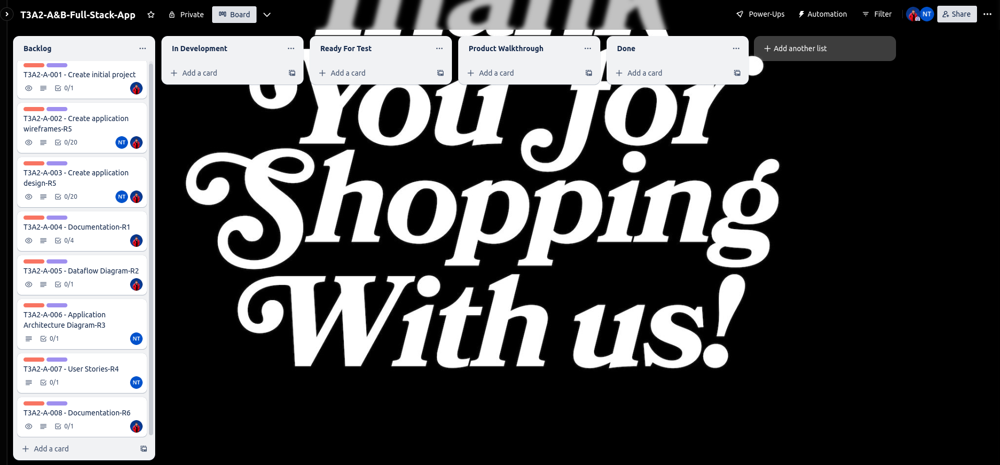
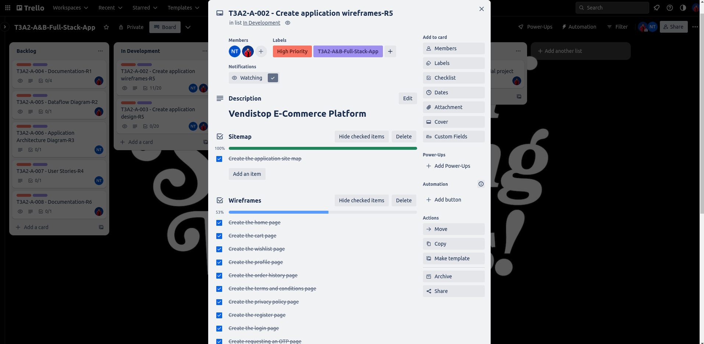
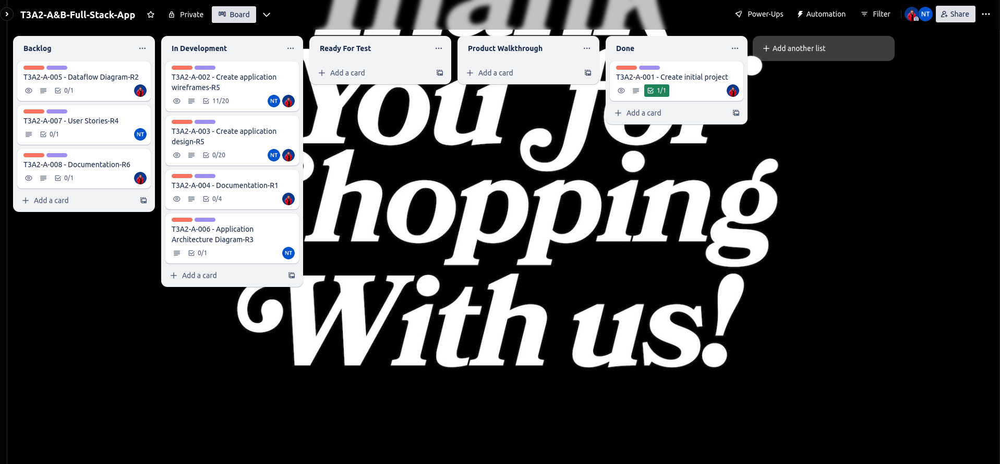
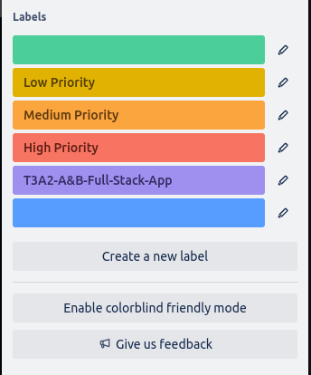

# Prateek Khindri and Nat Tucknott's T3A2-A Full Stack Application

# Vendistop E-commerce Store

## R1: Description of your website, including:

**Vendistop is a singular vendor E-commerce platform designed to bring products to the digital marketplace, enabling consumers to browse and purchase with ease. This platform focuses on providing a seamless shopping experience, from product exploration to the final purchase. It integrates an efficient payment system, while also providing a comprehensive administrative interface for the platform's offerings.**

### **Purpose**

**The main purpose of Vendistop is to provide a digital platform for a specific vendor or business to showcase and sell their products, eliminating the restrictions of geographical boundaries. It empowers the vendor to manage their product offerings and track orders, while also offering customers a user-friendly shopping experience.**

### **Functionality / features**

- **User Registration/Login**

  **Venditop facilitates easy user registration and login, allowing shoppers to create personal profiles for a customized and streamlined shopping experience.**

- **Product Browsing**

  **Users can conveniently browse through various products listed across multiple categories.**

- **Wishlist**

  **This feature enables users to save their favorite products for later consideration or purchase.**

- **Purchase**

  **The platform integrates Stripe, a robust and secure online payment processor, to facilitate smooth and safe transactions.**

- **Admin Dashboard**

  **This feature provides an administrative user with the ability to manage product listings and categories through CRUD (Create, Read, Update, and Delete) operations. It also provides an overview of all orders and their details.**

- **AWS S3 Integration**

  **All product images are securely stored in AWS S3, ensuring reliable availability and scalability.**

### **Target audience**

**Vendistop primarily targets online shoppers interested in the vendor's product offerings. Given the platform's user-friendly design, the target audience encompasses anyone interested in a straightforward online shopping experience. On the other end, Vendistop serves the administrative user responsible for product management and order tracking.**

### **Tech stack**

**The technology stack for Vendistop remains the same, utilizing a diverse set of tools and libraries to create a secure, efficient, and user-friendly platform. These technologies include:**

**Frontend:**

- **React**

  **A JavaScript library for building user interfaces.**

- **Redux Toolkit**

  **The official, opinionated, batteries-included toolset for efficient Redux development.**

- **Axios**

  **A promise-based HTTP client for making HTTP requests.**

- **React-Router-DOM**

  **A standard routing library for React.**

- **React-toastify**

  **Allows you to add notifications to your app with ease.**

- **Tailwind CSS**

  **A utility-first CSS framework for rapidly building custom user interfaces.**

**Backend:**

- **Node.js with Express**

  **A minimal and flexible Node.js web application framework, providing a robust set of features for web and mobile applications.**

- **Mongoose**

  **A MongoDB object modeling tool designed to work in an asynchronous environment.**

- **JWT (jsonwebtoken)**

  **Used to securely transmit information between parties as a JSON object.**

- **Bcryptjs**

  **A library to help hash passwords.**

- **Helmet**

  **Helps secure Express apps by setting various HTTP headers.**

- **Joi**

  **Object schema validation library.**

- **Nodemailer**

  **A module for Node.js to send emails.**

- **Cors**

  **A Node.js package for providing a Connect/Express middleware that can be used to enable CORS (Cross-origin resource sharing).**

- **Dotenv**

  **A zero-dependency module that loads environment variables from a .env file into process.env.**

- **Morgan**

  **HTTP request logger middleware for Node.js.**

- **UUID**

  **A library to create unique identifiers.**

- **Slugify**

  **A library to convert strings into URL-friendly and SEO-friendly slugs.**

**Infrastructure:**

- **AWS S3**

  **An object storage service that offers industry-leading scalability, data availability, security, and performance.**

## R2: Dataflow Diagram

## R3: Application Architecture Diagram

## R4: User Stories

## R5: Wireframes for multiple standard screen sizes, created using industry standard software

## R6: Screenshots of your Trello board throughout the duration of the project

**The [Trello](https://trello.com/) project management platform was used to manage the application's implementation plan and design. I was successful at planning, prioritising, and organising my activities into digestible portions.**







### **An _Agile_ based sprint board can be created as depicted below :**

- ### **Backlog**

  - **Includes the tasks that must be completed for a project**

- ### **In Development**

  - **Includes tasks that must be completed or are being worked on.**

- ### **Ready For Test**

  - **Includes tasks that are completed and are in the testing phase**

- ### **Product Walkthrough**

  - **Includes tasks for a senior team-member to review before presenting it to the client for feedback**

- ### **Ready For Release**

  - **Includes tasks/features ready for client feedback**

- ### **Done**

  - **Includes all completed tasks**

However, we did not include the _`Product Walkthrough`_ list in the board. In addition, each task was color-coded according to priority, with red representing high priority, orange representing medium priority, and yellow representing low priority. In addition, for each activity, a checklist of checklist items was provided, which aided in breaking down the tasks into smaller components. Finally, each job was assigned a serial number, which made it much easier to make frequent commits to a remote repository.

The color-coded scheme is depicted below.



## **Managing and Tracking Tasks: How We Succeeded**

- Using labels and color coding to categorise tasks

- Utilising a checklist for each item or task

- Setting up due dates to track the progress of each task

- Reviewing and updating the board regularly

- Writing and participating in stand ups with our peers and educators on Discord

A link to the [Trello](https://trello.com/) workspace can be found [here](https://trello.com/b/w4eRNmdQ/t3a2-ab-full-stack-app)

```
https://trello.com/b/w4eRNmdQ/t3a2-ab-full-stack-app
```
